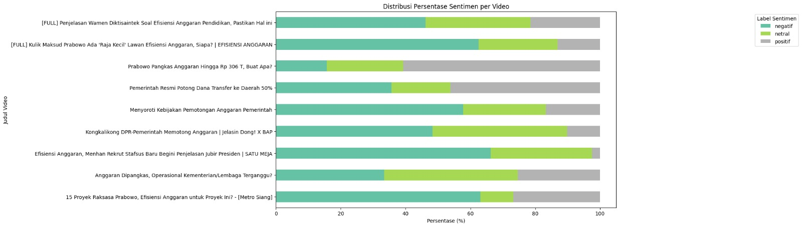
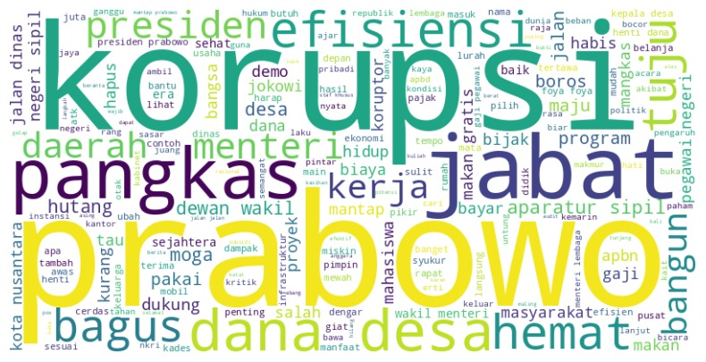
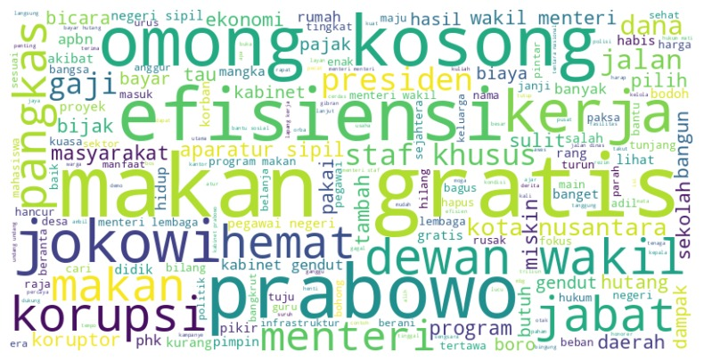

# Analisis Sentimen dan Persepsi Publik terhadap Pemotongan Anggaran Inpres 1/2025 di Media Sosial

> Collaborative Project — Data Analyst & Researcher

## Project Overview

Instruksi Presiden (Inpres) No. 1 Tahun 2025 mengenai efisiensi anggaran belanja pemerintah pusat dan daerah memunculkan berbagai respons dari masyarakat Indonesia di media sosial. Media sosial menjadi salah satu ruang utama bagi masyarakat untuk menyampaikan pendapat, kritik, dukungan, maupun kekhawatiran terhadap suatu kebijakan. Oleh karena itu, analisis sentimen dan persepsi publik dilakukan untuk memahami bagaimana masyarakat merespons kebijakan efisiensi anggaran tersebut.

> Project ini merupakan collaborative project yang berfokus pada pengolahan dan analisis data teks dari komentar YouTube untuk mengidentifikasi pola sentimen, topik pembahasan, serta persepsi publik terhadap kebijakan efisiensi anggaran.

### Tujuan

Project ini bertujuan untuk:

1. Mengidentifikasi isu-isu utama yang muncul dalam pembahasan mengenai Inpres No. 1 Tahun 2025.
2. Menganalisis sentimen publik terhadap kebijakan efisiensi anggaran.
3. Mengidentifikasi respons publik terhadap berbagai isu yang berkaitan dengan kebijakan tersebut.
4. Menggambarkan ekspektasi dan kekhawatiran publik terhadap implementasi kebijakan efisiensi anggaran.

---

## Workflow

Analisis dilakukan melalui beberapa tahapan berikut:

### 1. Data Collection

Data yang digunakan dalam project ini berupa komentar publik dari YouTube yang membahas kebijakan efisiensi anggaran berdasarkan Inpres No. 1 Tahun 2025. Data dikumpulkan dengan menggunakan kata kunci yang relevan dengan topik penelitian, kemudian komentar yang diperoleh digunakan sebagai sumber data untuk analisis teks. Total data yang dianalisis mencapai lebih dari 3.900 komentar YouTube.

### 2. Data Preprocessing

Melakukan text preprocessing untuk mempersiapkan data sebelum dianalisis, meliputi:
- Normalisasi teks
- Penanganan slang
- Penghapusan stopwords
- Penghapusan karakter yang tidak diperlukan
- Stemming

### 3. Exploratory Text Analysis

Melakukan eksplorasi terhadap data teks untuk memahami:
- Distribusi komentar berdasarkan waktu
- Kata-kata yang sering muncul (wourcloud analysis)
- Pola pembahasan publik
- Topik yang dominan
---

## Key Findings

### 1. Isu Utama yang Dibahas Publik

Berdasarkan analisis bigram, percakapan publik mengenai kebijakan efisiensi anggaran banyak berfokus pada isu **prioritas dan penggunaan anggaran pemerintah**. Hal ini menunjukkan bahwa pembahasan publik tidak hanya menyoroti kebijakan pemotongan anggaran, tetapi juga mempertanyakan bagaimana anggaran pemerintah seharusnya dialokasikan dan digunakan.

### 2. Dukungan terhadap Tujuan Kebijakan

Sebagian percakapan menunjukkan respons yang mendukung **tujuan efisiensi anggaran dan upaya pemberantasan korupsi**. Hal tersebut tercermin dari kemunculan kata dan frasa yang berkaitan dengan:
- Efisiensi anggaran
- Penghematan anggaran
- Pemberantasan korupsi
- Transparansi
- Penggunaan anggaran

Temuan ini menunjukkan bahwa sebagian publik mengaitkan efisiensi anggaran dengan upaya mengurangi pemborosan serta meningkatkan transparansi dalam pengelolaan anggaran pemerintah.

### 3. Skeptisisme terhadap Implementasi Kebijakan

Selain respons yang mendukung tujuan kebijakan, ditemukan pula percakapan yang menunjukkan **skeptisisme terhadap implementasinya**. Kemunculan frasa seperti *"omong kosong"* menunjukkan adanya keraguan terhadap efektivitas pelaksanaan kebijakan. Namun, temuan ini perlu dipahami sebagai indikasi adanya **keraguan terhadap implementasi**, bukan secara langsung sebagai penolakan terhadap tujuan efisiensi anggaran. Hal ini menunjukkan bahwa persepsi publik tidak hanya dipengaruhi oleh tujuan kebijakan, tetapi juga oleh **kepercayaan terhadap bagaimana kebijakan tersebut diterapkan.

---
## Conclusion

### **Support terhadap Tujuan Kebijakan**
Sebagian percakapan menyoroti pentingnya efisiensi, penghematan anggaran, transparansi, serta pemberantasan korupsi sebagai bagian dari tujuan kebijakan.

### **Skeptisisme terhadap Implementasi**
Di sisi lain, terdapat percakapan yang mempertanyakan efektivitas pelaksanaan kebijakan dan bagaimana tujuan efisiensi tersebut dapat diwujudkan dalam praktik.

### **Overall Insight**
Dengan demikian, persepsi publik terhadap kebijakan efisiensi anggaran tidak hanya dapat dilihat dari perspektif **dukungan atau penolakan**, tetapi juga dari bagaimana masyarakat memandang **tujuan kebijakan dan tingkat kepercayaan terhadap implementasinya**.

## Project Type

**Collaborative Project**

### Team Members

| Name |
|---|
| Ulfatul Adawiyah |
| Muhammad Abdul Ghofur |
| Miranita Anisa Rohmah |
| Syafiqah Marsya Kholiyadi |

### Role

**Data Analyst & Researcher**

My Contributed to:
- Data understanding
- Data preparation
- Presentation
